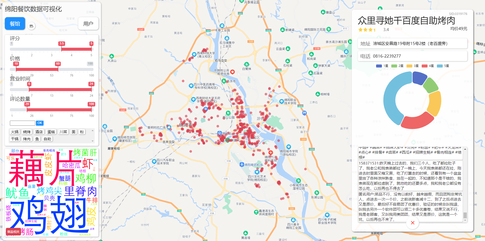
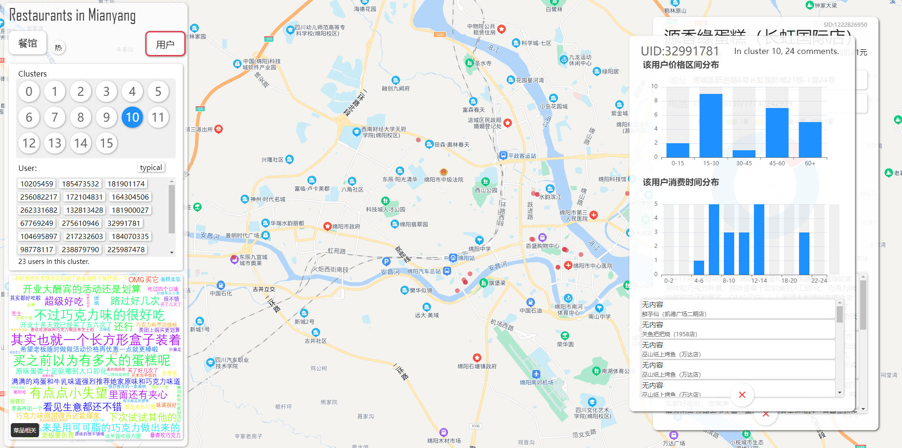

# 餐饮类消费数据的可视化分析系统

可视化小组作业，基于Flask,jquery,echarts,sklearn  环境` Ubuntu 20 LTS ` , ` python 3.8 ` ,分辨率1920pxx1080px,未适配其他分辨率。 


依赖安装：
```bash
pip3 install flask
pip3 install wordcloud
pip3 install sklearn
```

运行:
```bash
cd Vis/src
python3 server.py
```
浏览器访问` http://127.0.0.1:5000 `

<div align="center">餐馆分析</div> 



<div align="center">用户分析</div> 




使用到的组件：
[Ion.RangeSlider](https://github.com/IonDen/ion.rangeSlider)
